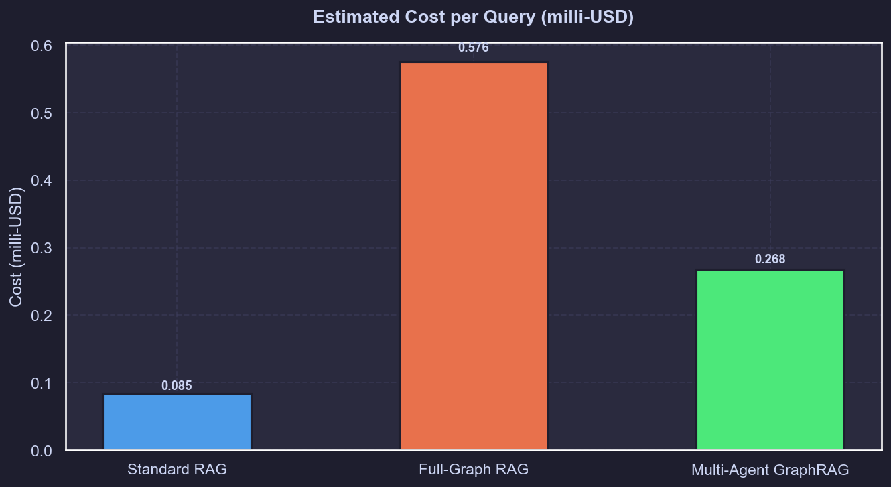
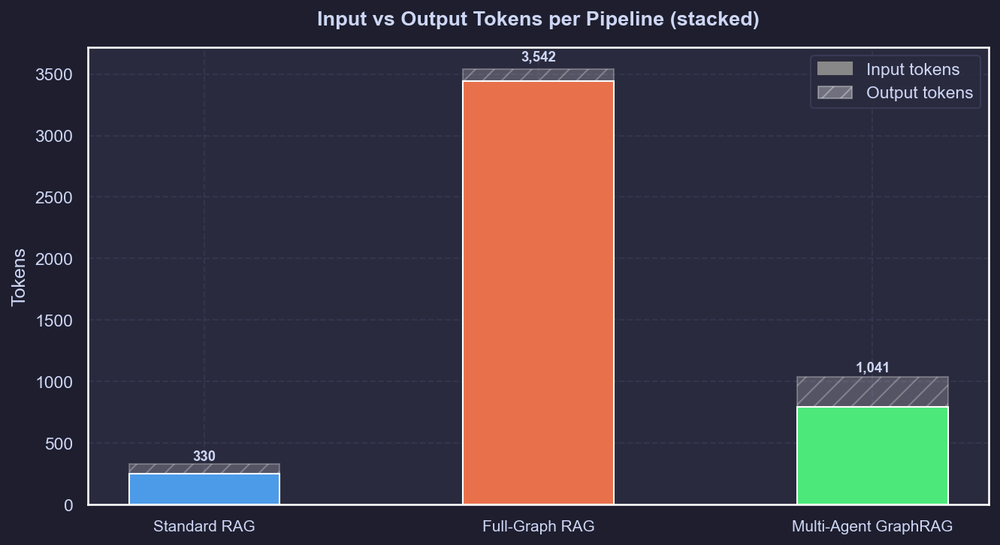
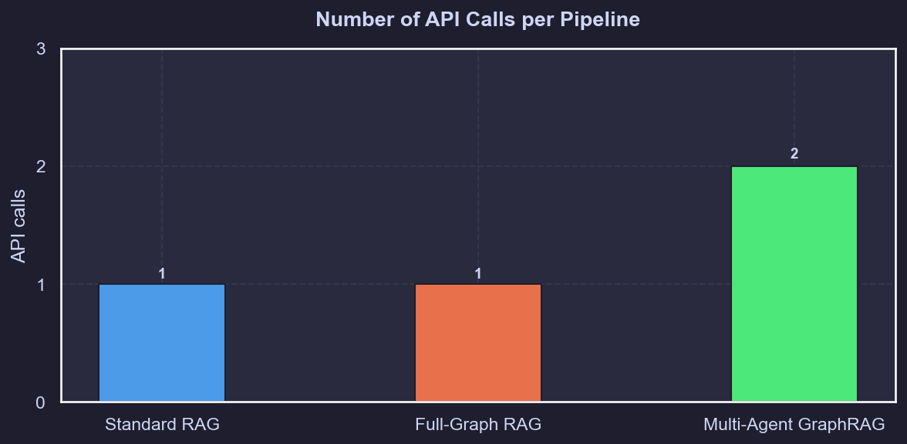
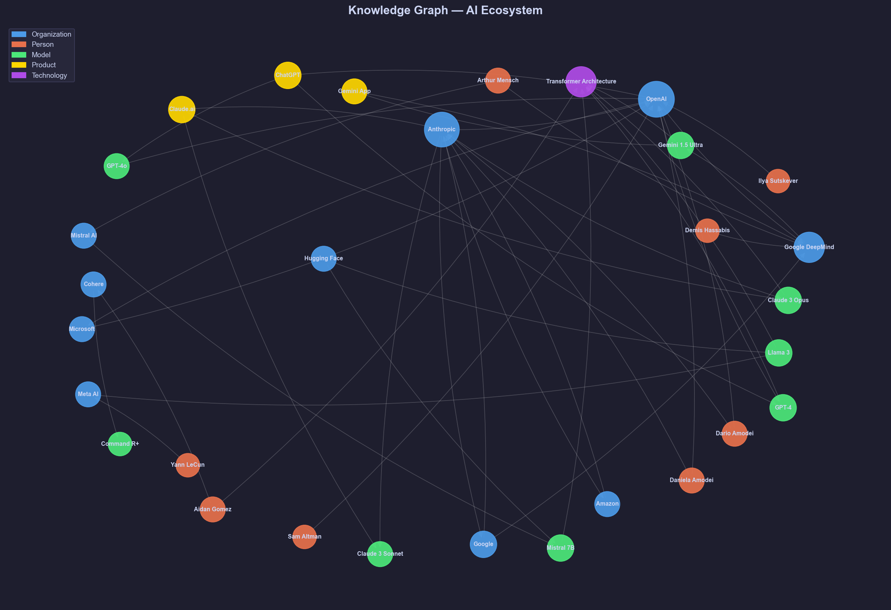
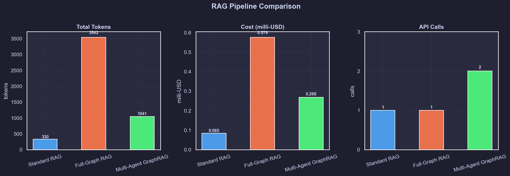

# Multi-Agent Parallel Graph-RAG Explorer

A knowledge-graph question-answering system that benchmarks three retrieval strategies side by side - from naive chunk retrieval to a fully parallel multi-agent pipeline - and measures the token cost of each.

---
## Architecture

```
                    [ User Query ]
                          |
          +---------------+---------------+
          |               |               |
   Standard RAG    Full-Graph RAG   Multi-Agent RAG
          |               |               |
   Top-k vector    Entire graph    [ Coordinator ]
     retrieval      as context      gpt-4o-mini
          |               |               |
          |               |     +---------+---------+
          |               |     |         |         |
          |               | [Worker A] [Worker B] [Worker C]
          |               |     |         |         |
          |               |     +----Qdrant search--+
          |               |          (parallel)
          |               |               |
          |               |        [ Aggregator ]
          |               |      deduplicate JSON
          +---------------+---------------+
                          |
                  [ gpt-4o-mini ]
                   Final answer
```

The **Coordinator** (gpt-4o-mini) breaks the user's question into 2–4 focused sub-queries. Each **Worker** runs in parallel via `asyncio.gather`, querying only the 1-hop neighbourhood of matching graph nodes. The **Aggregator** merges and deduplicates the JSON results, and the synthesizer produces the final answer from that condensed context alone.

---

## The Three Pipelines

| | Standard RAG | Full-Graph RAG | Multi-Agent GraphRAG |
|---|---|---|---|
| **Retrieval** | Top-5 vector search | Entire graph as plain text | Parallel 1-hop subgraph queries |
| **Context sent to LLM** | 5 node descriptions | All 32 nodes + 47 edges | Deduplicated entity JSON only |
| **API calls** | 1 | 1 | 2 (coordinator + synthesizer) |
| **Orchestration** | None | None | LangGraph + asyncio |

---

## Results

All numbers are from a single live run on the same question using `gpt-4o-mini`.

### Token Usage


Sending the entire graph verbatim costs **3,443 input tokens** per query. The multi-agent pipeline sends only the condensed, agent-gathered context: **793 input tokens** - a 77% reduction, with richer and more structured answers.

### Cost per Query



At gpt-4o-mini pricing, the full-graph approach costs **0.576 milli-USD** per query. Multi-agent comes in at **0.268 milli-USD** - less than half, despite making two API calls. The gap grows with graph size.

### Input vs Output Breakdown



Input tokens dominate in every pipeline. The full-graph approach produces fewer output tokens (99) than multi-agent (248) - the agents surface more structured facts that the synthesizer reasons over in depth.

### API Calls



Multi-agent makes two LLM calls: one cheap coordinator call to plan the search, and one synthesis call on the condensed result. The parallel Qdrant worker queries are local and free.

### Knowledge Graph



The graph covers 32 entities (organisations, people, models, products, one core technology) and 47 directed relationships across the global AI ecosystem. Node size scales with degree - OpenAI and Anthropic are the most connected hubs.

### Full Dashboard



---

## LangChain

The project uses two components from the LangChain ecosystem. **LangChain Tools** (`@tool` decorator in `tools.py`) wraps the Qdrant subgraph search into a typed, invokable function that each worker agent calls - this keeps worker prompts minimal and scoped to a single entity neighbourhood. **LangGraph** (`StateGraph` in `multi_agent.py`) wires the coordinator → workers → aggregator → synthesizer nodes into a compiled graph with typed shared state, including a reducer that merges parallel worker results without race conditions.

---

## Quick Start

**1. Install**
```bash
pip install -r requirements.txt
```

**2. Configure**
```bash
# Add your OPENAI_API_KEY to .env
```

**3. Run**
```bash
python main.py                          # all 3 pipelines, default question
python main.py --query "Your question"  # custom question
python main.py --pipeline multi         # multi-agent only
python main.py --pipeline full          # full-graph only
python main.py --questions              # 3 built-in demo questions
python main.py --graph-only             # render knowledge graph only
python main.py --no-charts              # skip chart generation
```

Charts are saved to `charts/` after every run.

---

## Project Structure

```
multi_agent_graph_rag/
├── main.py
├── data/
│   └── knowledge_graph.json
├── src/
│   ├── config.py
│   ├── graph_store.py             # Qdrant in-memory + fastembed ingestion
│   ├── tools.py                   # LangChain Tool: query_qdrant_subgraph
│   ├── token_tracker.py           # per-call token and cost accounting
│   ├── visualization.py           # matplotlib + seaborn charts
│   └── pipelines/
│       ├── standard_rag.py        # Pipeline 1: top-k vector retrieval
│       ├── full_graph.py          # Pipeline 2: entire graph as context
│       └── multi_agent.py         # Pipeline 3: LangGraph + parallel workers
├── charts/                        # generated on each run
└── tests/
    ├── test_graph_store.py
    ├── test_tools.py
    ├── test_pipeline_mock.py      # full integration test, no API key needed
    └── test_visualization.py
```

---

## Stack

- **LangGraph 1.2** - pipeline orchestration and typed state management
- **LangChain** - `@tool` decorator for scoped agent search functions
- **Qdrant (in-memory)** - vector store, no external server required
- **fastembed** - local ONNX embeddings (`BAAI/bge-small-en-v1.5`)
- **OpenAI gpt-4o-mini** - coordinator and synthesizer
- **networkx** - graph structure and layout
- **matplotlib + seaborn** - chart rendering
